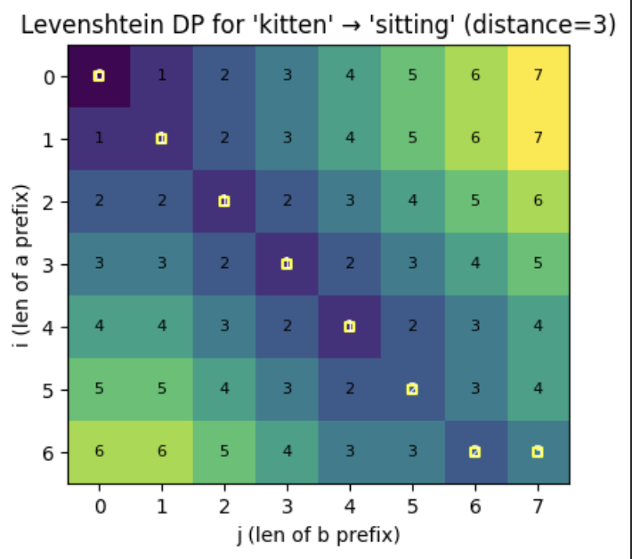
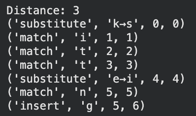
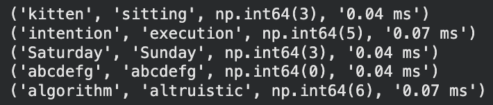

# Levenshtein Edit Distance Visualizer

A Python implementation of the Levenshtein edit distance algorithm with edit-path reconstruction, dynamic programming matrix visualization, and performance benchmarking.

---

## Overview

This project computes the Levenshtein edit distance between two strings and reconstructs the sequence of edit operations (insertions, deletions, substitutions). It also visualizes the dynamic programming matrix used in the computation, highlighting the optimal transformation path.

Additionally, the project includes benchmarking to analyze runtime performance across different input sizes.

---

## Features

- Computes Levenshtein edit distance between two strings
- Reconstructs optimal edit sequence (insert, delete, substitute)
- Visualizes the dynamic programming matrix and backtracking path
- Benchmarks runtime performance on different input sizes

---

## Example

**Input:**
- String A: `kitten`
- String B: `sitting`

**Output:**
- Distance: `3`

**Operations:**
- Substitute `k → s`
- Match `i`
- Match `t`
- Match `t`
- Substitute `e → i`
- Match `n`
- Insert `g`

---

## Performance

The implementation runs in:

- **Time Complexity:** O(n × m)  
- **Space Complexity:** O(n × m)

where `m` and `n` are the lengths of the two input strings.

### Benchmark Results

